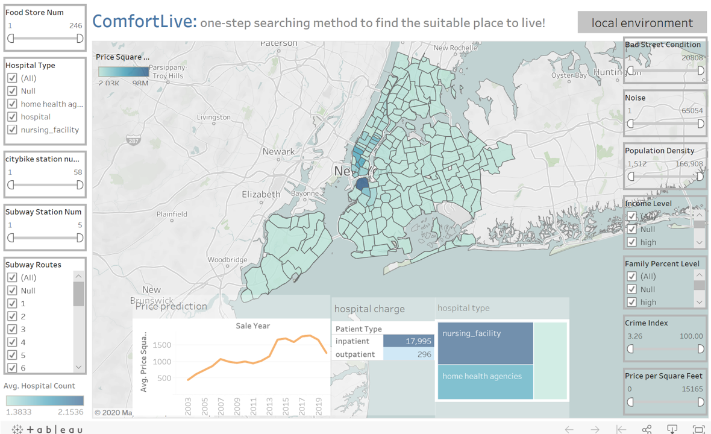
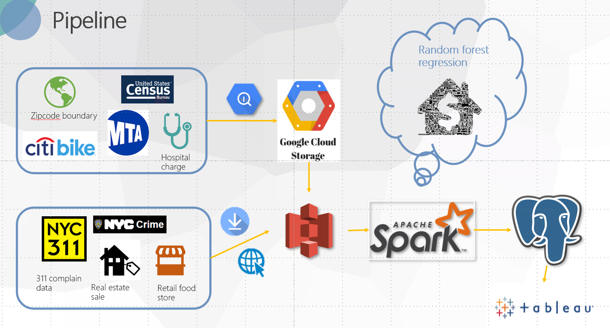

# ComfortLive
This project build a pipline to process 9 dataset, provide a recommendation system that can help people find the best place to live in New York!

[Demo presentation slides](https://docs.google.com/presentation/d/1rJVsnWBVw5YVxCkrvSKoIK1mgGuXMmxFsxjY6NX7psI/edit?usp=sharing)

[Website](http://predictionsanalytics.xyz/)

*Due to the AWS credit limitation, this webpage cannot be display all the time. If you are interested, please contact me to start it.*


## Table of Contents
1. [Motivation](README.md#motivation)
1. [Pipline](README.md#pipline)
1. [Requirements](README.md#requirements)
1. [Architechture](README.md#architechture)
1. [DataSet](README.md#dataset)
1. [File Structure](README.md#File-Structure)
1. [Methodology](README.methodology)


## Motivation
People spend plenty of time to choose a new place to live. They need to check local environment, like crime rate, local hospital cost, available transportation, income level locally through different APP: 
* [nyc crime map](https://maps.nyc.gov/crime/)
* [nyc hospital map](https://www.targetmap.com/viewer.aspx?reportId=3065)
* [citybike station map](https://member.citibikenyc.com/map/)
* [google map](https://www.google.com/maps/place/New+York,+NY)
* [Median Income Across the US (WNYC)](https://project.wnyc.org/median-income-nation/#4/37.65/-85.12)
* etc...

This project provide a one-stope searching method to give recommendation to people based on their own preference.


## Pipline


**Figure 1.** Pipeline depicting the flow of data.


## Requirements
* Python 3
* Ubuntu


## Architechture

### BigQuery --> Google Cloud Storage
* [Get into your GCS bucket](https://cloud.google.com/storage/?utm_source=google&utm_medium=cpc&utm_campaign=na-US-all-en-dr-bkws-all-all-trial-e-dr-1008076&utm_content=text-ad-none-any-DEV_c-CRE_79747411687-ADGP_Hybrid+%7C+AW+SEM+%7C+BKWS+%7C+US+%7C+en+%7C+EXA+~+Google+Cloud+Storage-KWID_43700007031545851-kwd-11642151515&utm_term=KW_google%20cloud%20storage-ST_google+cloud+storage&gclid=CjwKCAiA98TxBRBtEiwAVRLqu-Q98O-7xe8Fvcte79YELjXsAud44dJ95qgW3-Pgyzuixv4uZde9HhoCLKwQAvD_BwE)
* [Find dataset on BigQuery](https://console.cloud.google.com/marketplace/browse?filter=solution-type:dataset)
* This is the [following steps](GCS/README.md)

### Google cloud Storage --> S3 bucket
[Instruction](http://proanalyst.net/migrate-files-gcs-into-amazon-s3/)


### Webpage --> s3 bucket
```
curl "https://download-link-address/" | aws s3 cp - s3://aws-bucket/data-file
```


### Spark
* [Instruction](https://docs.google.com/document/d/1InLxbu-FH2nyd0NuJ3ewdvAt0Ttk_bNUwlQop38lq0Q/edit)
* [Standby Instruction](https://github.com/InsightDataScience/pegasus)
* After configuration, run those command to create a new database:
```
    sudo -u postgres psql
    CREATE DATABASE mydb;
    CREATE USER db_select WITH PASSWORD '<setpassword>';
    GRANT ALL PRIVILEGES ON DATABASE mydb TO db_select;
    \connect mydb
 ```
 * Run python file by fllowing command:
 ```
 spark-submit --master spark://<instance url > :7077 --jars <jar file path> <filename>
 ```


### PostgreSQL
[Instruction](https://blog.insightdatascience.com/simply-install-postgresql-58c1e4ebf252)


### Frount-End
* [Tableau to html file](https://www.youtube.com/watch?v=wJ2CHIJalNU)
* This is the [following steps](Frount-End/README.md)


## Dataset

* [US census data](https://console.cloud.google.com/bigquery?project=plucky-sound-238319&folder&organizationId&p=bigquery-public-data&d=census_bureau_acs&t=zip_codes_2017_5yr&page=table)
* [US census population](https://console.cloud.google.com/bigquery?project=plucky-sound-238319&folder&organizationId&p=bigquery-public-data&d=census_bureau_usa&t=population_by_zip_2010&page=table)
* [Hospital Cost](https://console.cloud.google.com/bigquery?project=plucky-sound-238319&folder&organizationId&p=bigquery-public-data&d=medicare&page=dataset)
* [Hospital type](https://console.cloud.google.com/bigquery?project=plucky-sound-238319&folder&organizationId&p=bigquery-public-data&d=cms_medicare&page=dataset)
* [New York CityBike](https://console.cloud.google.com/bigquery?project=plucky-sound-238319&folder&organizationId&p=bigquery-public-data&d=new_york_citibike&t=citibike_stations&page=table)
* [New York Subway](https://console.cloud.google.com/bigquery?project=plucky-sound-238319&folder&organizationId&p=bigquery-public-data&d=new_york_subway&t=stations&page=table)
* [DOB Complaints Received](https://data.cityofnewyork.us/Housing-Development/DOB-Complaints-Received/eabe-havv)
* [Retail Food Stores](https://data.ny.gov/Economic-Development/Retail-Food-Stores/9a8c-vfzj)
* [Crime and rolling sale dataset](https://drive.google.com/open?id=1N_VBlx5wupROKt040-z0NJFsvYK_cSzv)


## File Structure
```
.
├── README.md
├── Frount-End
│   ├── README.md
│   ├── namecheap.png
│   ├── security.png
│   ├── main.py
|   └── templates
|       └── index.html
├── GCS
│   └── README.md
|
├── spark
│   ├── README.md
│   ├── function.py
│   ├── ml_model_rf.py
│   ├── ml_preprocess_function.py
│   ├── run.py
│   └── config.ini
└── image
    ├── pipeline.png
    └── web.png

```

## Methodology

### 1. Pre-process dataset and calculation
```diff
+ All dataset are pre-processed to calculate average value based on zip code
```
Some details about data schema desighd for each dataset can be found on code and demo presentation slides

#### a) Transfer longitude and latitude to zip code:
Using <a href="https://uszipcode.readthedocs.io/index.html">uszipcode</a>, install it on pyspark.
* Download `.whl` file
* Store it under one of your own folder
* Terminal access into this folder
* `pip3 install <whl file>`

### 2. Output table:
Those well-processed tables stored in PostgreSQL, then visualized by Tableau. 

|zip_code| 
| ---------- |
|Income_level|
|Age_level|
|Family_percent_level|
|Population_density|
|Citybike_station_num|
|Price_square_feet|
|Food_store_num|
|Crime_index|
|Quite_community|
|Better_street_condition|
|Internal_point_lat|
|Internal_point_lon|

|zip_code| 
| ---------- |
|Subway_routes|
|Subway_num|

|zip_code| 
| ---------- |
|Hospital_type|
|Hospital_count|
|Patient_type|
|Average_payment|

|zip_code| 
| ---------- |
|Noise| 
|bad_street_condition|


### 3. Machine Learning process

Build an random forest regression model to predict housing price for 2020 based on zipcode. 

#### a) Input features:
| zip_code      | 
| ---------- |
| price_square_feet| 
| total_units| 
| building_age |
| gross_square_feet|
| Crime_index|
| GDP_growth_rate|
| median_income|
| vacant_housing_percent|
| percent_income_spent_on_rent|
| median_age|
| sub_station_num|
| food_store_num|

#### b) Lable:
| price_square_feet (next year)|
| ---------- | 


#### c) Output table:
| zip_code|
| ---------- | 
| Sale_year | 
| price_square_feet|
| price_growth_rate|


